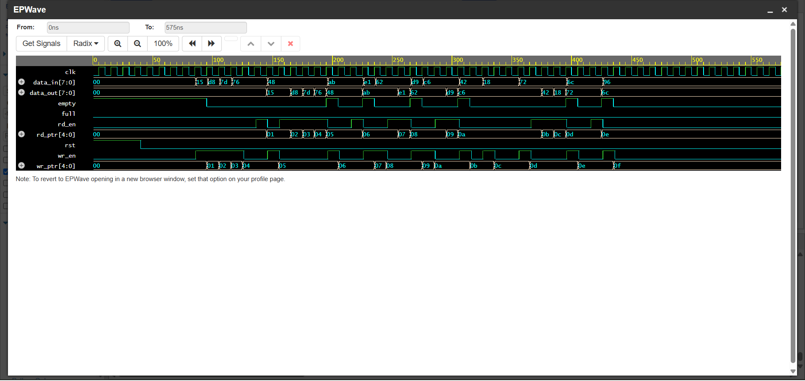

# sync-fifo-design-and-verification
This project implements a parameterized Synchronous FIFO using SystemVerilog along with a complete modular verification environment. The verification architecture follows a component-based methodology consisting of Generator, Driver, Monitor, Scoreboard, Environment, and Test classes communicating through mailboxes.
# Synchronous FIFO Design and Verification
## Waveform

## Simulation Output 1

## Simulation Output 2

## Simulation Output 3

